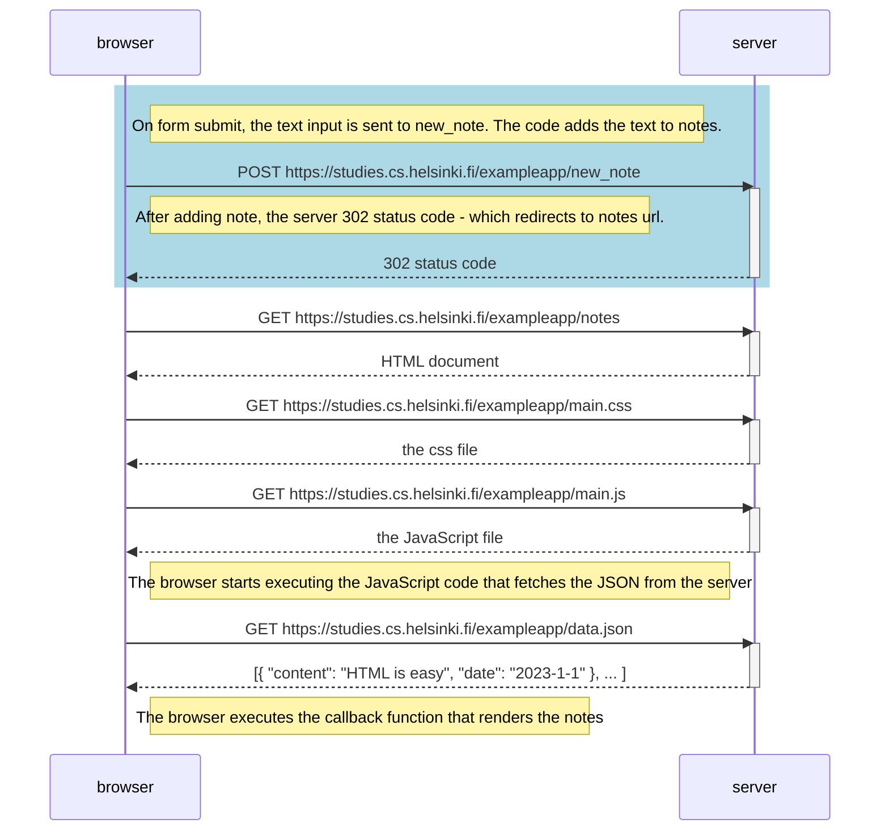

```mermaid
sequenceDiagram
    participant browser
    participant server

    rect rgb(173,216,230)
    Note right of browser: On form submit, the text input is sent to new_note. The code adds the text to notes.
    browser->>server: POST https://studies.cs.helsinki.fi/exampleapp/new_note
    activate server 
    Note right of browser: After adding note, the server 302 status code - which redirects to notes url.
    server-->>browser: 302 status code 
    deactivate server
    end

    browser->>server: GET https://studies.cs.helsinki.fi/exampleapp/notes
    activate server
    server-->>browser: HTML document
    deactivate server

    browser->>server: GET https://studies.cs.helsinki.fi/exampleapp/main.css
    activate server
    server-->>browser: the css file
    deactivate server

    browser->>server: GET https://studies.cs.helsinki.fi/exampleapp/main.js
    activate server
    server-->>browser: the JavaScript file
    deactivate server

    Note right of browser: The browser starts executing the JavaScript code that fetches the JSON from the server

    browser->>server: GET https://studies.cs.helsinki.fi/exampleapp/data.json
    activate server
    server-->>browser: [{ "content": "HTML is easy", "date": "2023-1-1" }, ... ]
    deactivate server

    Note right of browser: The browser executes the callback function that renders the notes
```