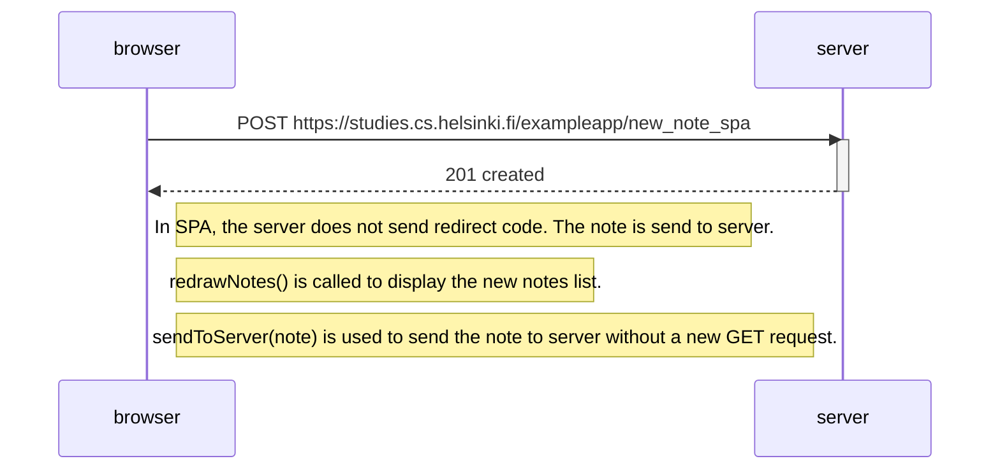

```mermaid
sequenceDiagram
    participant browser
    participant server

    browser->>server: POST https://studies.cs.helsinki.fi/exampleapp/new_note_spa
    activate server
    server-->>browser: 201 created
    deactivate server
    Note right of browser: In SPA, the server does not send redirect code. The note is send to server.
    Note right of browser: redrawNotes() is called to display the new notes list.
    Note right of browser: sendToServer(note) is used to send the note to server without a new GET request.
    
```